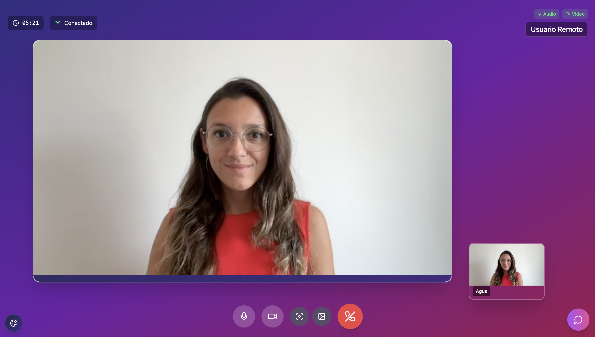

# Zoom Video Call App 🎥 (In Progress)

A modern and customizable video calling application built using **Zoom Video SDK**, **React**, **Vite**, and **TypeScript**. The app includes video/audio management, real-time remote video tracking, chat integration (WIP), and dynamic UI theming

⚠️ **This project is currently under active development. Some features are incomplete or experimental.**

---

## 🚀 Features

- 📹 Join Zoom video sessions with real-time audio and video
- 🎛️ Local/remote video and audio controls
- 🎭 Background blur support
- 💬 Floating in-call chat (WIP)
- 🎨 Theme selector (light/dark/custom themes)
- 📱 Responsive, modern UI with Radix UI primitives

---



## 🧠 Core Component: `VideoCall.tsx`

The `VideoCall` component handles:

- Initializing the Zoom Video SDK client
- Joining sessions with parameters from `window` globals:
  ```ts
  window.sessionName = 'your-session-name';
  window.accesstoken = 'your-access-token';
  window.sessionPassword = 'your-session-password';
  window.userIdentity = 'your-user-id';
Managing video/audio state for local and remote users

Rendering:

LocalVideoContainer

RemoteVideo

CallControls

ThemeSelector

FloatingChat

📦 Tech Stack

Framework:	React 18
Build Tool:	Vite
Language:	TypeScript
Styling:	TailwindCSS, shadcn/ui
Component UI:	Radix UI
Video Engine:	Zoom Video SDK

🛠️ Installation

git clone https://github.com/your-org/zoom-video-app
cd zoom-video-app
npm install

🧪 Development
To run the app locally:

npm run dev

To build for production:

npm run build

To preview the production build:

npm run preview

🧰 Available Scripts

npm run dev         # Start dev server
npm run build       # Build for production
npm run preview     # Preview production build
npm run lint        # Lint codebase

⚙️ Environment Setup
You must configure your Zoom Video SDK credentials and session data before starting a call. These values are expected as global variables (e.g., injected via script):

window.sessionName = 'session-name';
window.accesstoken = 'access-token';
window.sessionPassword = 'session-password';
window.userIdentity = 'user-identity';

📋 To-Do (Planned)

- Implement call end handling
- Enable real-time chat functionality
- Add support for custom virtual backgrounds
- Improve error handling & connection recovery
- Unit and integration tests
- Backend service to generate TOKEN
- Screenshots and demo GIFs

